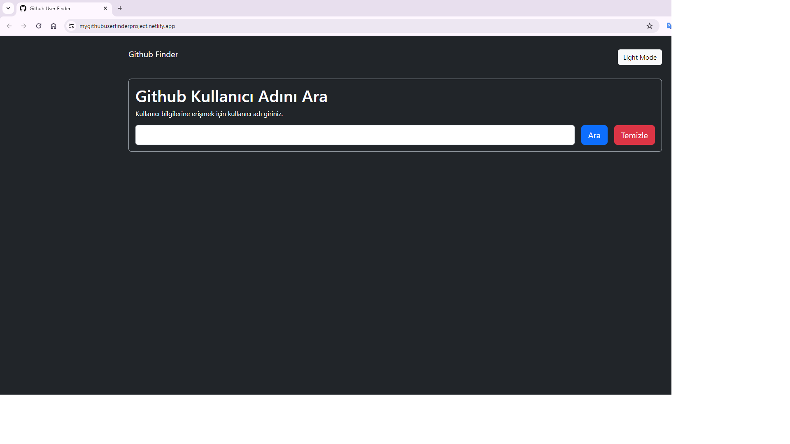

<h1>Github User Finder Project </h1>

The Github User Finder Project is an interactive tool that allows web developers to easily examine user profiles on GitHub. This project was developed using HTML, CSS, and JavaScript and stands out with its user-friendly interface. The project allows users to quickly access information by searching GitHub accounts. 
Features: User Search, Information Profile, Followers and Following, Repository Information, Favorite Repositories

Github Kullanıcı Bulucu Projesi, web geliştiricilerin GitHub üzerindeki kullanıcı profillerini kolayca incelemelerini sağlayan interaktif bir araçtır. Bu proje, HTML, CSS ve JavaScript kullanılarak geliştirilmiştir ve kullanıcı dostu arayüzüyle dikkat çekmektedir. Proje, kullanıcıların GitHub hesaplarını aratarak hızlı bir şekilde bilgilere ulaşmalarını sağlar.
Özellikler: Kullanıcı Arama, Profil Bilgileri Goruntuleme,Takipçiler ve Takip Edilenler,Repository Bilgileri,Favori Repository

<h2> The following technologies were used in the frontend development phase of my site: </h2>

- HTML5
- CSS
- Javascript

<h2> Visit My Github User Finder Project: </h2>

- https://mygithubuserfinderproject.netlify.app/

<h4>IMAGE</h4>

